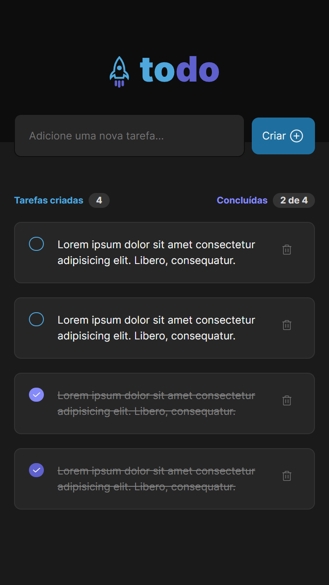

# Desafio Ignite React 2022 

  

Durante este desafio, utilizamos os conceitos básicos do React desenvolvendo do zero uma simples lista de tarefas com as opções de criar e apagar um item da lista. Essa aplicação apesar de simples é um excelente exemplo para praticar o desenvolvimento de apps CRUD (Create, Read, Update, Delete).

### 🛠️ Nesse projeto foi utilizado

- Vite
- React.js
- Styled-components
- Typescript
- Local Storage

## 🎨 Layout

### Desktop

 
  

### Mobile

       
  
  

Feito com 💜 por [Douglas Santos](https://github.com/DouglasSantos-code)
